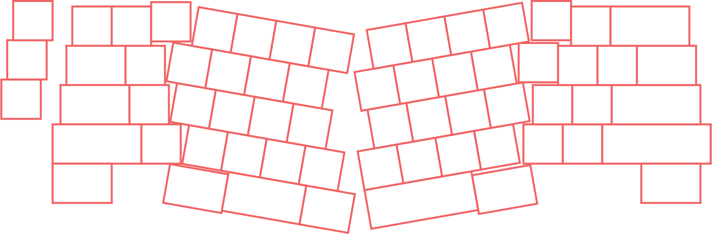
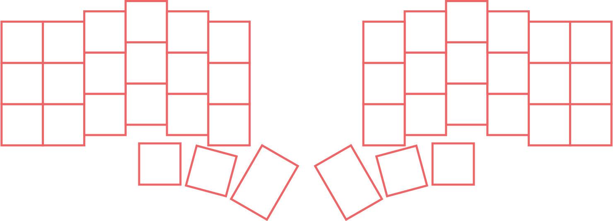
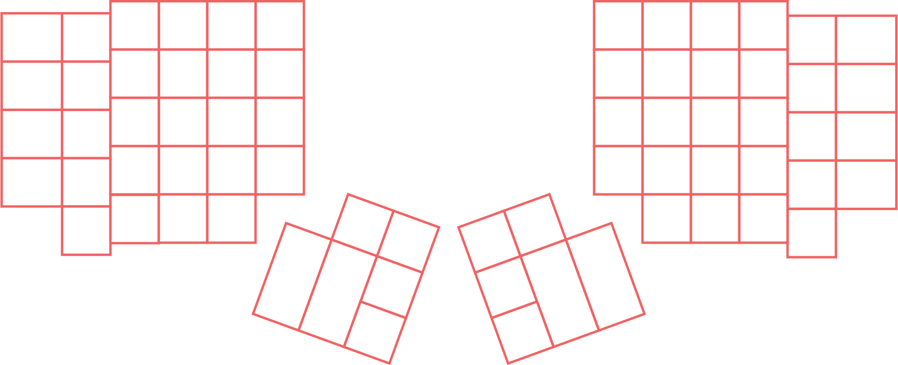
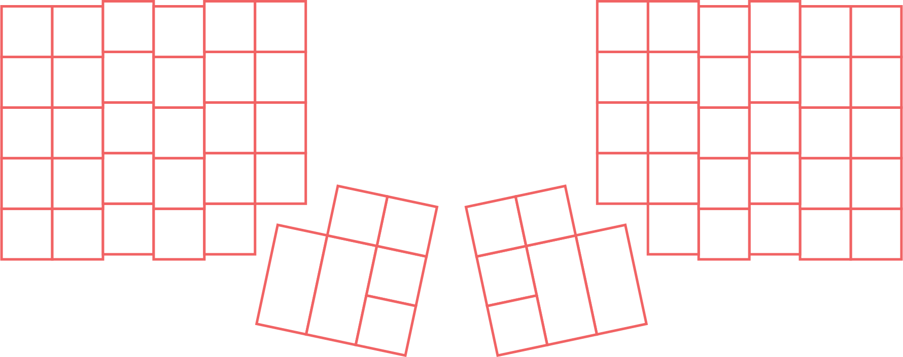
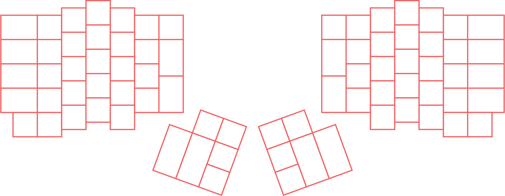
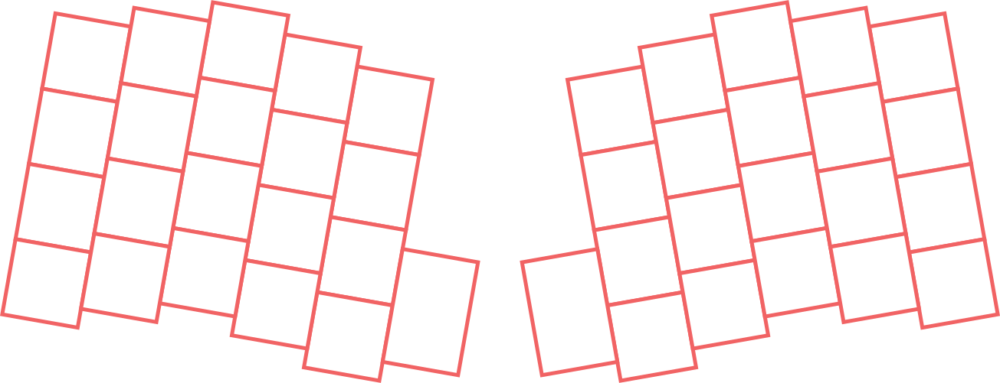
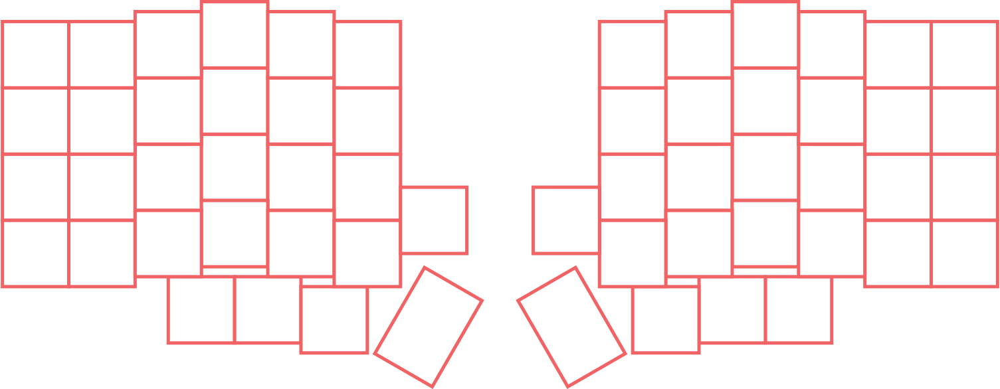
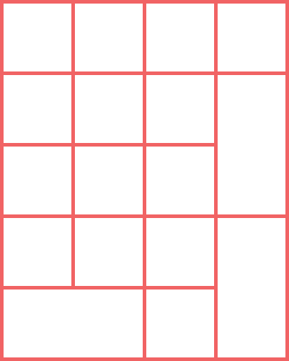

<h3 align="center" >
  <!--
  github color: brightgreen
  label color: #505050
  mastodon color: #6364FF
  mozilla color: #6e008b
  box color: #F0F0F0
  -->

  

    
  

  <h3 align="center">
    Keyboard Layouts
  </h3>
  
  <h6 align="center">
    by <a href="https://nickesc.github.io">N. Escobar</a> / <a href="https://github.com/nickesc">nickesc</a>
      
    
  </h6>
  <h6 align="center">
    various keyboard layouts in SVG and PNG formats, organized by category/size
  </h6>
  

    
  

</h3>

## Layouts

Below is a table listing the available layouts, with each row containing a different category of keyboard layouts.

Category | Layouts | &nbsp;&nbsp;&nbsp;&nbsp;&nbsp;&nbsp;&nbsp;&nbsp;&nbsp;&nbsp;&nbsp;| &nbsp;&nbsp;&nbsp;&nbsp;&nbsp;&nbsp;&nbsp;&nbsp;&nbsp;&nbsp;&nbsp; | &nbsp;&nbsp;&nbsp;&nbsp;&nbsp;&nbsp;&nbsp;&nbsp;&nbsp;&nbsp;&nbsp;| &nbsp;&nbsp;&nbsp;&nbsp;&nbsp;&nbsp;&nbsp;&nbsp;&nbsp;&nbsp;&nbsp;| &nbsp;&nbsp;&nbsp;&nbsp;&nbsp;&nbsp;&nbsp;&nbsp;&nbsp;&nbsp;&nbsp;| &nbsp;&nbsp;&nbsp;&nbsp;&nbsp;&nbsp;&nbsp;&nbsp;&nbsp;&nbsp;&nbsp;| &nbsp;&nbsp;&nbsp;&nbsp;&nbsp;&nbsp;&nbsp;&nbsp;&nbsp;&nbsp;&nbsp;|&nbsp;&nbsp;&nbsp;&nbsp;&nbsp;&nbsp;&nbsp;&nbsp;&nbsp;&nbsp;&nbsp;|
-|-|-|-|-|-|-|-|-|-|
**40%-50%** | <a href='out/SVG/40%25-50%25/40%25 + Numpad.svg'> 40% + Numpad</a> | <a href='out/SVG/40%25-50%25/Zlant.svg'> Zlant</a> | <a href='out/SVG/40%25-50%25/40%25.svg'> 40%</a> | <a href='out/SVG/40%25-50%25/50%25 (TMO).svg'> 50% (TMO)</a> | <a href='out/SVG/40%25-50%25/Exploded 45%25.svg'> Exploded 45%</a> | <a href='out/SVG/40%25-50%25/Mini 1800-40%25 1800-1400.svg'> Mini 1800/40% 1800/1400</a> | <a href='out/SVG/40%25-50%25/45%25.svg'> 45%</a> | <a href='out/SVG/40%25-50%25/45%25 HHKB.svg'> 45% HHKB</a> | 
**60%-75%** | <a href='out/SVG/60%25-75%25/70%25.svg'> 70%</a> | <a href='out/SVG/60%25-75%25/660.svg'> 660</a> | <a href='out/SVG/60%25-75%25/HHKB.svg'> HHKB</a> | <a href='out/SVG/60%25-75%25/Exploded 75%25.svg'> Exploded 75%</a> | <a href='out/SVG/60%25-75%25/Exploded 65%25.svg'> Exploded 65%</a> | <a href='out/SVG/60%25-75%25/60%25.svg'> 60%</a> | <a href='out/SVG/60%25-75%25/63-64%25-GK64.svg'> 63/64%/GK64</a> | <a href='out/SVG/60%25-75%25/75%25.svg'> 75%</a> | <a href='out/SVG/60%25-75%25/65%25.svg'> 65%</a> | 
**1800 & 96%** | <a href='out/SVG/1800 & 96%25/1800.svg'> 1800</a> | <a href='out/SVG/1800 & 96%25/FRL 1800.svg'> FRL 1800</a> | <a href='out/SVG/1800 & 96%25/75%25 + Numpad.svg'> 75% + Numpad</a> | <a href='out/SVG/1800 & 96%25/96%25.svg'> 96%</a> | <a href='out/SVG/1800 & 96%25/FRL 96%25.svg'> FRL 96%</a> | <a href='out/SVG/1800 & 96%25/Compact 1800.svg'> Compact 1800</a> | 
**TKL-110%** | <a href='out/SVG/TKL-110%25/TK (Ten Key).svg'> TK (Ten Key)</a> | <a href='out/SVG/TKL-110%25/TKL (Tenkeyless).svg'> TKL (Tenkeyless)</a> | <a href='out/SVG/TKL-110%25/FRL (F-Rowless).svg'> FRL (F-Rowless)</a> | <a href='out/SVG/TKL-110%25/60  + Numpad.svg'> 60  + Numpad</a> | <a href='out/SVG/TKL-110%25/100%25.svg'> 100%</a> | <a href='out/SVG/TKL-110%25/110%25.svg'> 110%</a> | 
**Southpaw** | <a href='out/SVG/Southpaw/65%25 Southpaw.svg'> 65% Southpaw</a> | <a href='out/SVG/Southpaw/Southpaw 1400-Min1800-40%25 1800.svg'> Southpaw 1400/Min1800/40% 1800</a> | <a href='out/SVG/Southpaw/TKL Southpaw.svg'> TKL Southpaw</a> | <a href='out/SVG/Southpaw/60%25 Southpaw.svg'> 60% Southpaw</a> | <a href='out/SVG/Southpaw/Full Size Southpaw.svg'> Full Size Southpaw</a> | <a href='out/SVG/Southpaw/40%25 Southpaw.svg'> 40% Southpaw</a> | 
**Regional** | <a href='out/SVG/Regional/ABNT (Brazilian).svg'> ABNT (Brazilian)</a> | <a href='out/SVG/Regional/ISO (European).svg'> ISO (European)</a> | <a href='out/SVG/Regional/ANSI (North American).svg'> ANSI (North American)</a> | <a href='out/SVG/Regional/KS (South Korean).svg'> KS (South Korean)</a> | <a href='out/SVG/Regional/JIS (Japanese).svg'> JIS (Japanese)</a> | 
**Ergo** | <a href='out/SVG/Ergo/Ergo + Arrow cluster.svg'> Ergo + Arrow cluster</a> | <a href='out/SVG/Ergo/Ergo.svg'> Ergo</a> | <a href='out/SVG/Ergo/Corne.svg'> Corne</a> | <a href='out/SVG/Ergo/Advantage2.svg'> Advantage2</a> | <a href='out/SVG/Ergo/Dactyl.svg'> Dactyl</a> | <a href='out/SVG/Ergo/Prime E.svg'> Prime E</a> | <a href='out/SVG/Ergo/Ergodox.svg'> Ergodox</a> | <a href='out/SVG/Ergo/Atreus.svg'> Atreus</a> | <a href='out/SVG/Ergo/Lily58.svg'> Lily58</a> | 
**Ortho** | <a href='out/SVG/Ortho/100%25-Full Size Ortho.svg'> 100%/Full Size Ortho</a> | <a href='out/SVG/Ortho/60%25 Ortho (Preonic).svg'> 60% Ortho (Preonic)</a> | <a href='out/SVG/Ortho/40%25 Ortho.svg'> 40% Ortho</a> | <a href='out/SVG/Ortho/75%25 Ortho.svg'> 75% Ortho</a> | <a href='out/SVG/Ortho/39%25 (Collide39).svg'> 39% (Collide39)</a> | 
**Big Boards** | <a href='out/SVG/Big Boards/122%25 (Battleship).svg'> 122% (Battleship)</a> | <a href='out/SVG/Big Boards/140%25 (Leviathan).svg'> 140% (Leviathan)</a> | <a href='out/SVG/Big Boards/88 Key Piano.svg'> 88 Key Piano</a> | <a href='out/SVG/Big Boards/173%25 (Hyper 7).svg'> 173% (Hyper 7)</a> | <a href='out/SVG/Big Boards/Space Cadet Keyboard.svg'> Space Cadet Keyboard</a> | 
**Macropads** | <a href='out/SVG/Macropads/2%25 (Milk).svg'> 2% (Milk)</a> | <a href='out/SVG/Macropads/1%25.svg'> 1%</a> | <a href='out/SVG/Macropads/6%25 (M6).svg'> 6% (M6)</a> | <a href='out/SVG/Macropads/Numpad + 4%25.svg'> Numpad + 4%</a> | <a href='out/SVG/Macropads/Numpad.svg'> Numpad</a> | <a href='out/SVG/Macropads/10%25 (M10).svg'> 10% (M10)</a> | <a href='out/SVG/Macropads/4%25-Arrows (Paw).svg'> 4%/Arrows (Paw)</a> | 

## License

[Keyboard Layout Infographics](https://github.com/nickesc/KeyboardLayouts) by [N. Escobar](https://github.com/nickesc) is licensed under [CC BY-SA 4.0](https://creativecommons.org/licenses/by-sa/4.0/)
</a>. See the <a href="/LICENSE">LICENSE</a> file for more information.

